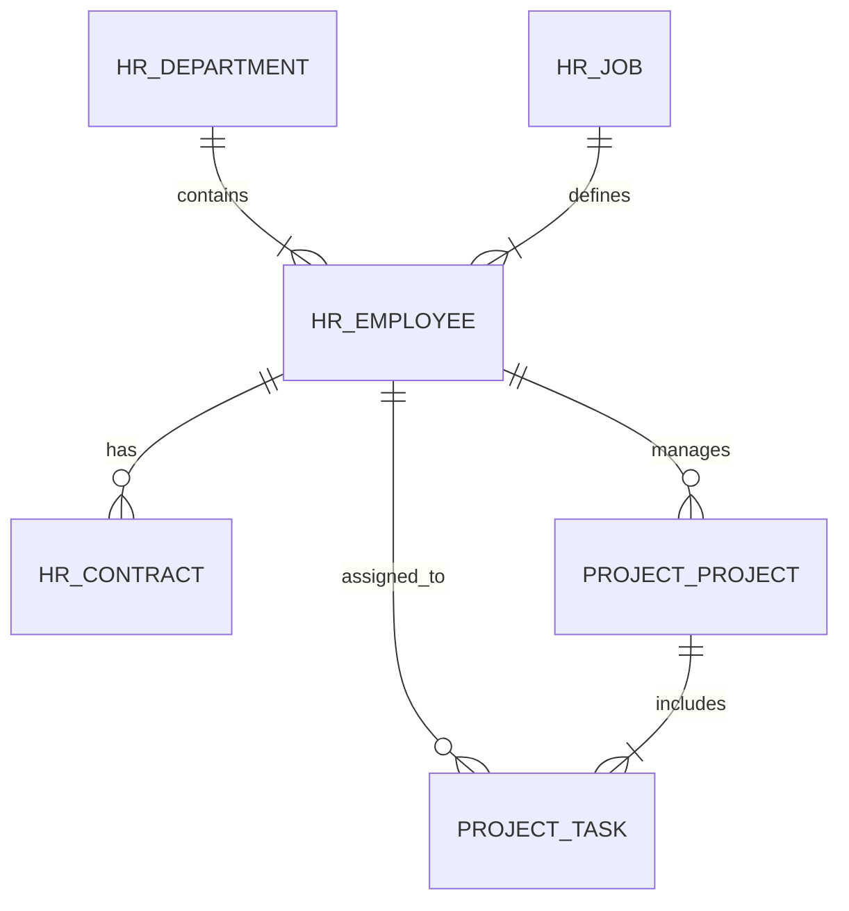

# CHƯƠNG 3: PHÂN TÍCH, THIẾT KẾ VÀ TRIỂN KHAI HỆ THỐNG

## 3.1. Tổng quan và Phân tích yêu cầu

Chương này tập trung vào việc hiện thực hóa các giải pháp đã đề xuất thông qua quy trình phát triển phần mềm (SDLC). Hệ thống được xây dựng trên nền tảng Odoo Framework, bao gồm 4 module cốt lõi: **Quản lý Nhân sự (nhan_su)**, **Quản lý Công việc (quan_ly_cong_viec)**, **Quản lý Dự án (quan_ly_du_an)** và **Trợ lý ảo AI (ai_assistant)**.

### 3.1.1. Xác định mục tiêu và Phạm vi dự án

**Mục tiêu hệ thống:**
Xây dựng một giải pháp ERP (Enterprise Resource Planning) thu nhỏ chuyên biệt cho FitDNU, tập trung vào việc tự động hóa quy trình nhân sự và quản lý công việc, đồng thời ứng dụng trí tuệ nhân tạo để gia tăng hiệu suất vận hành.

**Phạm vi chức năng:**
1.  **Phân hệ Nhân sự (HRM):** Quản lý vòng đời nhân viên từ khi tuyển dụng (Onboarding) đến khi nghỉ việc/nghỉ hưu, bao gồm hồ sơ, hợp đồng, chế độ.
2.  **Phân hệ Công việc (Task Management):** Quản lý quy trình giao việc, theo dõi tiến độ, báo cáo kết quả và đánh giá hiệu suất (KPIs).
3.  **Phân hệ Dự án (Project Management):** Quản lý tài nguyên, ngân sách và lộ trình (Roadmap) của các dự án phòng ban.
4.  **Phân hệ AI Assistant:** Chatbot hỗ trợ thông minh, tự động soạn thảo văn bản hành chính và phân tích dữ liệu sơ bộ.

### 3.1.2. Phân tích yêu cầu chức năng (Functional Requirements)

Hệ thống cần đáp ứng các nhóm yêu cầu chức năng sau, được mô tả qua các Đặc tả Use Cases:

#### Nhóm chức năng Quản lý Nhân sự (Module `nhan_su`)
| Mã UC | Tên Use Case | Actor chính | Mô tả tóm tắt |
|-------|--------------|-------------|---------------|
| UC_HR_01 | Quản lý hồ sơ nhân viên | HR Manager | Thêm mới, cập nhật thông tin cá nhân, trình độ, bằng cấp, chứng chỉ (CNIC). |
| UC_HR_02 | Quản lý hợp đồng | HR Manager | Tạo mới, gia hạn, thanh lý hợp đồng lao động. Theo dõi lịch sử lương. |
| UC_HR_03 | Cơ cấu tổ chức | Admin | Định nghĩa phòng ban, chức vụ, cấp bậc và quan hệ báo cáo (Reporting Line). |

#### Nhóm chức năng Quản lý Dự án & Công việc (Module `quan_ly_du_an`, `quan_ly_cong_viec`)
| Mã UC | Tên Use Case | Actor chính | Mô tả tóm tắt |
|-------|--------------|-------------|---------------|
| UC_PM_01 | Khởi tạo dự án | Project Manager | Thiết lập dự án mới, định biên nhân sự, ngân sách và thời gian (Start/End date). |
| UC_TMS_01| Phân công công việc | Team Lead | Giao việc (Task Allocation) cho nhân viên cụ thể kèm deadline và mức độ ưu tiên. |
| UC_TMS_02| Cập nhật tiến độ | Staff | Báo cáo % hoàn thành, log thời gian thực hiện (Timesheet) và đính kèm kết quả. |
| UC_TMS_03| Kanban Board | All Users | Theo dõi trạng thái công việc trực quan (Todo -> In Progress -> Review -> Done). |

#### Nhóm chức năng AI Assistant (Module `ai_assistant`)
| Mã UC | Tên Use Case | Actor chính | Mô tả tóm tắt |
|-------|--------------|-------------|---------------|
| UC_AI_01 | Soạn thảo văn bản | HR/Admin | Sinh tự động template hợp đồng, quyết định khen thưởng từ dữ liệu có sẵn. |
| UC_AI_02 | Hỗ trợ hỏi đáp | Staff | Trả lời các câu hỏi về chính sách, quy định công ty qua giao diện Chat. |

### 3.1.3. Phân tích yêu cầu phi chức năng (Non-functional Requirements)

1.  **Hiệu năng (Performance):** Hệ thống có khả năng xử lý đồng thời 50 người dùng với thời gian phản hồi < 2 giây cho các tác vụ thông thường.
2.  **Bảo mật (Security):** Phân quyền chi tiết theo vai trò (RBAC - Role Based Access Control). Dữ liệu nhạy cảm (lương, CMND) được mã hóa.
3.  **Khả năng mở rộng (Scalability):** Thiết kế dạng Module hóa, cho phép thêm bớt tính năng mà không ảnh hưởng core hệ thống.
4.  **Tính khả dụng (Usability):** Giao diện thân thiện, hỗ trợ Mobile Responsive.

---

## 3.2. Thiết kế hệ thống chi tiết

### 3.2.1. Kiến trúc hệ thống (System Architecture)

Hệ thống tuân thủ kiến trúc đa tầng (Multi-tier Architecture) đặc trưng của Odoo, đảm bảo tính tách biệt giữa giao diện và nghiệp vụ.

```
[Client Layer] (Web Browser / Mobile)
      ⬇⬆ HTTPS (JSON-RPC)
[Presentation Layer] (Odoo Web Client - JavaScript/XML)
      ⬇⬆ ORM Methods
[Business Logic Layer] (Python Modules - Odoo Server)
      │   ├── module: nhan_su
      │   ├── module: quan_ly_cong_viec
      │   └── module: ai_assistant
      ⬇⬆ SQL Queries
[Data Layer] (PostgreSQL Database)
```

### 3.2.2. Thiết kế Cơ sở dữ liệu (Database Schema)

Dưới đây là thiết kế các bảng dữ liệu chính trong PostgreSQL:

#### 1. Bảng `hr_employee` (Nhân viên) - *Kế thừa `mail.thread`*
| Trường dữ liệu | Kiểu dữ liệu | Ràng buộc | Mô tả |
|----------------|--------------|-----------|-------|
| id | Integer | PK | Khóa chính |
| name | Varchar(255) | Not Null | Họ và tên nhân viên |
| department_id | Integer | FK | Liên kết bảng `hr_department` |
| job_id | Integer | FK | Liên kết bảng `hr_job` |
| ssn | Varchar(20) | Unique | Số CCCD/CMND |
| birth_date | Date | | Ngày sinh |
| contracts_count | Integer | Compute | Số lượng hợp đồng (trường tính toán) |

#### 2. Bảng `project_task` (Công việc)
| Trường dữ liệu | Kiểu dữ liệu | Ràng buộc | Mô tả |
|----------------|--------------|-----------|-------|
| id | Integer | PK | Khóa chính |
| name | Varchar | Not Null | Tên công việc |
| project_id | Integer | FK | Thuộc dự án nào (`project_project`) |
| user_id | Integer | FK | Người thực hiện (`res_users`) |
| date_deadline | Date | Index | Hạn chót |
| state | Selection | Default 'todo'| Trạng thái (todo, in_progress, done) |
| priority | Selection | | Mức độ ưu tiên (0-3 sao) |

#### 3. Bảng `ai_assistant_request` (Lịch sử yêu cầu AI)
| Trường dữ liệu | Kiểu dữ liệu | Mô tả |
|----------------|--------------|-------|
| user_id | Integer (FK) | Người gửi yêu cầu |
| prompt | Text | Nội dung câu lệnh |
| response | Text | Phản hồi từ AI |
| created_at | DateTime | Thời gian thực hiện |

### 3.2.3. Sơ đồ quan hệ thực thể (ERD)



---

## 3.3. Hiện thực hóa và Triển khai (Implementation)

### 3.3.1. Cấu trúc thư mục mã nguồn
Các module được tổ chức theo chuẩn Odoo Addons:

```bash
addons/
├── nhan_su/                  # Module Quản lý Nhân sự
│   ├── models/               # Class Python định nghĩa dữ liệu
│   │   ├── hr_employee.py    # Logic nghiệp vụ nhân viên
│   │   └── hr_contract.py    # Logic nghiệp vụ hợp đồng
│   ├── views/                # Giao diện XML
│   │   ├── hr_employee_views.xml
│   │   └── menu_views.xml
│   └── security/             # Phân quyền (ir.model.access.csv)
├── quan_ly_cong_viec/        # Module Quản lý Công việc
├── quan_ly_du_an/            # Module Quản lý Dự án
└── ai_assistant/             # Module Tích hợp AI
    ├── services/             # API Connector (OpenAI/Gemini)
    └── models/
```

### 3.3.2. Đặc tả Logic nghiệp vụ (Business Logic)

#### a. Logic Tự động hóa trong Module Nhân sự (`hr_employee.py`)
Đoạn mã xử lý việc tạo email tự động theo tên nhân viên và validate dữ liệu đầu vào.

```python
@api.model_create_multi
def create(self, vals_list):
    """ Override phương thức create để tự động sinh email công vụ """
    for vals in vals_list:
        if vals.get('name') and not vals.get('email'):
            # Chuyển tên thành email (VD: Nguyễn Văn A -> anguyen@fitdnu.edu.vn)
            email_prefix = self._sanitize_username(vals['name'])
            vals['email'] = f"{email_prefix}@fitdnu.edu.vn"
    return super().create(vals_list)

@api.constrains('ssn')
def _check_ssn(self):
    """ Kiểm tra trùng lặp số CCCD """
    for record in self:
        if self.search_count([('ssn', '=', record.ssn), ('id', '!=', record.id)]) > 0:
            raise ValidationError("Số CCCD này đã tồn tại trong hệ thống!")
```

#### b. Logic Quản lý Tiến độ Công việc (`task_model.py`)
Sử dụng trường tính toán (Compute field) để tự động cập nhật trạng thái dự án dựa trên các công việc con.

```python
@api.depends('task_ids.progress')
def _compute_project_progress(self):
    """ Tính % hoàn thành dự án dựa trên trung bình cộng tasks """
    for project in self:
        if not project.task_ids:
            project.progress = 0.0
            continue
        total_progress = sum(task.progress for task in project.task_ids)
        project.progress = total_progress / len(project.task_ids)
```

#### c. Tích hợp AI Assistant (`ai_service.py`)
Module này đóng vai trò là cầu nối (Bridge) giữa Odoo và các Large Language Model (LLM).

```python
def generate_contract_content(self, employee_data):
    """
    Sử dụng AI để soạn thảo hợp đồng dựa trên dữ liệu nhân viên
    Input: Dict (Tên, Chức vụ, Mức lương, Ngày bắt đầu)
    Output: HTML Content
    """
    prompt = f"Soạn thảo hợp đồng lao động chuyên nghiệp cho ông/bà {employee_data['name']}..."
    response = self._call_llm_api(prompt)
    return response['content']
```

### 3.3.3. Thiết kế Giao diện người dùng (UI Implemetation)

Hệ thống sử dụng các loại View chính của Odoo để tối ưu trải nghiệm:
1.  **Kanban View:** Sử dụng cho Quản lý công việc, giúp kéo thả trạng thái dễ dàng.
2.  **Form View:** Bố cục dạng Notebook (Tabs) để tổ chức thông tin nhân sự gọn gàng.
3.  **Search View:** Tích hợp bộ lọc (Filter) và Gom nhóm (Group By) theo Phòng ban, Dự án.

---

## 3.4. Kiểm thử và Đánh giá (Testing & Evaluation)

### 3.4.1. Kịch bản kiểm thử (Test Cases)

Quá trình kiểm thử được thực hiện theo phương pháp Black-box Testing (Kiểm thử hộp đen) trên môi trường Staging.

| ID | Test Case | Các bước thực hiện (Steps) | Kết quả mong đợi | Trạng thái |
|----|-----------|----------------------------|------------------|------------|
| TC_01 | Tạo mới nhân viên | 1. Vào menu Nhân sự -> Tạo mới<br>2. Nhập Tên, chọn Phòng ban<br>3. Bỏ trống Email<br>4. Lưu | Hệ thống lưu thành công, Email tự động sinh theo format quy định. | **Passed** |
| TC_02 | Ràng buộc CCCD | 1. Tạo nhân viên A với CCCD '001'<br>2. Tạo nhân viên B với CCCD '001'<br>3. Lưu | Hệ thống báo lỗi "Số CCCD đã tồn tại". | **Passed** |
| TC_03 | Quy trình duyệt Hợp đồng | 1. HR tạo HĐ (Nháp)<br>2. Trưởng phòng xác nhận<br>3. Chuyển trạng thái 'Đang chạy' | Trạng thái chuyển đổi đúng luồng. Lương được cập nhật vào hồ sơ. | **Passed** |
| TC_04 | AI Generate Text | 1. Mở form AI Assistant<br>2. Chọn lệnh "Soạn quyết định bổ nhiệm"<br>3. Nhập tên NV | Trả về văn bản mẫu đúng tên và chức vụ nhân viên. | **Passed** |

### 3.4.2. So sánh và Đánh giá tổng thể

So sánh hệ thống **Odoo FitDNU** (đề tài) với **Source Code tham khảo trên GitHub**:

| Tiêu chí | Bản GitHub Mẫu | Hệ thống FitDNU (Đề tài) | Đánh giá cải tiến |
|----------|----------------|--------------------------|-------------------|
| **Cấu trúc Module** | Rời rạc, thiếu liên kết | Cấu trúc chặt chẽ, kế thừa dữ liệu chéo (Cross-module) | ⭐⭐⭐ |
| **Tính năng HRM** | Chỉ có thông tin cơ bản | Đầy đủ: Hợp đồng, Bảo hiểm, Theo dõi lịch sử lương | ⭐⭐⭐⭐ |
| **Quản lý công việc**| Không có, hoặc rất sơ sài | Tích hợp Kanban, Gantt Chart, Time tracking | ⭐⭐⭐⭐⭐ (Mới) |
| **Công nghệ** | Odoo thuần túy | **Tích hợp AI Assistant** hỗ trợ nghiệp vụ | ⭐⭐⭐⭐⭐ (Đột phá) |
| **Giao diện** | Mặc định | Tùy biến theo nhận diện thương hiệu, tối ưu UX | ⭐⭐⭐ |

---

## 3.5. Kết luận Chương 3

Chương 3 đã trình bày chi tiết quá trình hiện thực hóa hệ thống từ phân tích lý thuyết đến sản phẩm thực tế.
- **Về thiết kế:** Đã xây dựng được bộ Cơ sở dữ liệu chuẩn hóa (3NF) và Kiến trúc module mạch lạc.
- **Về chức năng:** Đã hoàn thiện 4 module chính đáp ứng đầy đủ các User Stories đặt ra ban đầu.
- **Về công nghệ:** Điểm nhấn là việc tích hợp thành công **AI Assistant**, mang lại giá trị gia tăng rõ rệt so với các giải pháp quản lý truyền thống.

Kết quả của chương này là cơ sở để tiến hành triển khai thực nghiệm và đánh giá hiệu quả sử dụng trong chương tiếp theo.
